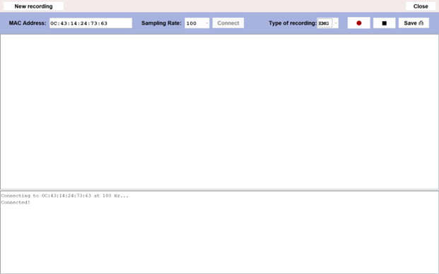
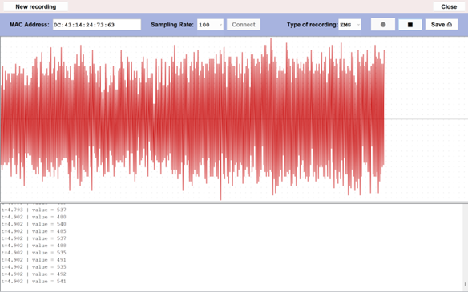
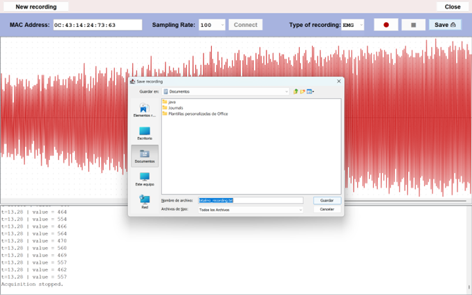

<a id="readme-top"></a>

<br />
<div align="center">
   <a href="https://github.com/alejandraoshea/sma-server">
     
   </a>

<h3 align="center">SMA Website</h3>

  <p align="center">
    Signal obtention application which allows recording EMG and ECG signals through a BITalino device and downloading them into a directory in your local computer.
  </p>
</div>

---

<details>
  <summary>Table of Contents</summary>
  <ol>
    <li><a href="#about-the-application">About The Application</a></li>
    <li><a href="#built-with">Built With</a></li>
    <li><a href="#getting-started">Getting Started</a></li>
    <li><a href="#usage">Usage</a></li>
    <li><a href="#license">License</a></li>
    <li><a href="#acknowledgments">Acknowledgments</a></li>
  </ol>
</details>

---

## About The Application

BITALINO-WINDOWS is an application designed to obtain a TXT file with a signal recording along with the sample rate. It supports:

- BITalino connection with the computer
- Sampling rate selection (10, 100 or 1000)
- Selection of the signal type to record (ECG or EMG)
- Stopping the signal acquisition when suitable or waiting for the maximum recording time to finish the recording (2 minutes)
- Reporting system for doctors

<p align="right"><a href="#readme-top">back to top</a></p>

---

## Built With

- Java (JavaSwing implementation for the GUI)

<p align="right"><a href="#readme-top">back to top</a></p>

---

## Getting Started

<p><span style="color:red"><strong>IMPORTANT:</strong></span> If you are here because you are a patient in MotivSMA, you should download the EXE file from the webpage. Go to:  
<a href="https://github.com/alejandraoshea/sma-client">https://github.com/alejandraoshea/sma-client</a>  
and follow the corresponding instructions.</p>

---

If you just want to make use of the code, follow these steps to set up a local development environment:

### Prerequisites

Before setting up the project locally, make sure you have the following installed:

#### Software Requirements
- Java 21 (JDK 21)
- Maven 3.8+
- A Java-compatible IDE
- Windows OS (recommended for Bluetooth compatibility)

#### Dependencies
These dependencies are installed automatically through Maven:

- `io.ultreia:bluecove:2.1.1` — Bluetooth communication
- `org.apache.commons:commons-lang3:3.15.0` — Apache utility library

#### For testing
- A **BITalino** device

---

### Installation

1. Clone the repository:
   ```sh
   git clone https://github.com/pilarbourg/bitalino-windows
   cd bitalino-windows

2. Build the project:
   ```sh
   mvn clean install

3. Run the application:

   Run the project by executing the `BitalinoApp` class, which contains the main entry point of the application.


<p align="right">(<a href="#readme-top">back to top</a>)</p>


## Usage

### 1. Connect to the BITalino Device
- Enter the **MAC address** of your BITalino device.
- Select the correct **sampling rate** (as indicated by your doctor).
- Make sure the BITalino is connected to your computer via **Bluetooth**.
- Click the **Connect** button.

If the connection is successful, a message will appear in the dashboard.

> Starting interface with a succesful bitalino connection:
> 

---

### 2. Start the Recording
- Select the type of measurement you want to record (**ECG** or **EMG**).
- Click the **Record** button (🔴).

### 3. Stop the Recording
- When you want to stop, click the **Stop** button (■).
- The elapsed time of the recording will be displayed in the dashboard.

> Example interface with a recording still active:
> 

---

### 4. Save the Recording
- Once you are satisfied with the signal, click the **Save** button.
- Choose a folder on your computer where you want to store the file.

> Example interface:
> 

---

### 5. Record Another Signal (Optional)
If you wish to record another signal, click **New recording**.  
The MAC address will remain saved—just select the sampling rate and repeat the previous steps.

---

### 📌 Note
You have a maximum of **2 minutes** to record your signal.  
If you are not satisfied with the result, simply record again without saving the previous file to your computer.


<p align="right">(<a href="#readme-top">back to top</a>)</p>

## License

Distributed under the MIT License.

<p align="right">(<a href="#readme-top">back to top</a>)</p>


## Acknowledgments

* Best README Template
* Contrib.rocks for contributors graph
* Spring Boot Documentation

<p align="right">(<a href="#readme-top">back to top</a>)</p>

